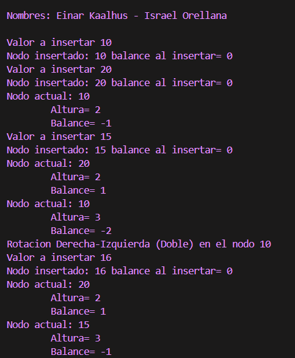

README: Ejemplos de Implementación de Sets en Java
📌 Información General
Título: Implementación de Tipos de Sets en Java

Asignatura: Estructura de Datos

Carrera: Computación

Estudiantes: Einar Kaalhus, Israel Orellana (asumiendo los mismos estudiantes del README anterior, si no, por favor corregir)

Fecha: Julio del 2025 (fecha actual)

Profesor: Ing. Pablo Torres (asumiendo el mismo profesor del README anterior, si no, por favor corregir)

🛠 Descripción
Este proyecto en Java explora y demuestra el uso de diferentes implementaciones de la interfaz Set, incluyendo HashSet, LinkedHashSet, y TreeSet. Se enfatiza cómo cada tipo de Set maneja el orden de inserción y el orden de los elementos, así como la capacidad de TreeSet para ordenar elementos utilizando un Comparator personalizado.

El programa crea y popula instancias de cada tipo de Set con una colección de palabras, mostrando cómo los elementos se almacenan y se iteran en cada caso.

🚀 Ejecución
Para ejecutar el proyecto:

Asegúrate de tener el Java Development Kit (JDK) instalado en tu sistema.

Compila los archivos Sets.java y App.java desde la raíz del proyecto. Si estás utilizando un IDE como VS Code o IntelliJ, la compilación se manejará automáticamente.

Ejecuta el archivo principal App.java.

Bash

# Desde la carpeta raíz del proyecto, si es necesario compilar manualmente
javac controller/Sets.java App.java
java App
🧪 Ejemplo de Salida por Consola
Plaintext

EINAR KAALHUS
---Hash Set---
Elementos del HashSet
Pera
Manzana
Celular
Laptop
---Linked Hash Set---
Elementos del LinkedHashSet
Laptop
Manzana
Pera
Celular
---Tree Set---
Elementos del TreeSet (orden alfabético natural)
Celular
Laptop
Manzana
Pera
---Tree Set comparador---
Elementos del TreeSet (orden por longitud y luego alfabético)
Pera
Laptop
Celulas
Celular
Manzana
---Tree Set comparador al revez---
Elementos del TreeSet (orden por longitud descendente y luego alfabético inverso)
Manzana
Celular
Celulas
Laptop
Pera
✅ Conclusiones
Este proyecto ilustra las características fundamentales de las diferentes implementaciones de Set en Java:

HashSet: No garantiza ningún orden específico de los elementos; el orden puede variar en cada ejecución. Es ideal para operaciones de adición, eliminación y búsqueda rápidas (tiempo promedio O(1)).

LinkedHashSet: Mantiene el orden de inserción de los elementos. Es útil cuando se necesita preservar el orden en el que se agregaron los elementos, además de las propiedades de un Set (no duplicados).

TreeSet: Almacena los elementos en un orden natural (alfabético para String, numérico para tipos primitivos envueltos) o un orden personalizado definido por un Comparator. Esto lo hace adecuado para colecciones donde los elementos deben estar siempre ordenados. La complejidad de sus operaciones es típicamente O(
logn).

La implementación con un Comparator personalizado permite ordenar elementos por criterios complejos, como la longitud de la cadena y luego alfabéticamente en caso de longitudes iguales, o incluso de forma inversa.

La elección del tipo de Set depende de los requisitos específicos de la aplicación en cuanto a orden y rendimiento.

public class App {

    public static void main(String[] args) throws Exception {

        System.out.println();

        System.out.println("Nombres: Einar Kaalhus - Israel Orellana");

        System.out.println();

        AVLTree arbolito = new AVLTree();

        arbolito.insert(10);

        arbolito.insert(20);

        arbolito.insert(15);

        arbolito.insert(16);

    }

}

public class AVLTree {

    private Node root;

    public int peso;

    public AVLTree() {

        this.root = null;

    }

    public void insert(int value) {

        System.out.println("Valor a insertar "+ value);

        root = insertRec(root, value);

        peso++;

    }

    private int height(Node node){

        if(node == null){

            return 0;

        }

        return node.getAltura();

    }

    private Node insertRec(Node node, int value) {

        if (node == null) {

            Node newNode = new Node(value);

            newNode.setAltura(1);

            System.out.println("Nodo insertado: "+newNode.getValue()+" balance al insertar= " +getBalance(newNode));

            return newNode;

        }

        if (value < node.getValue()) {

            // ME VOY A LA IZQUIERDA

            node.setLeft(insertRec(node.getLeft(), value));

        } else if (value > node.getValue()) {

            // ME VOY A LA DERECHA

            node.setRight(insertRec(node.getRight(), value));

        }else{

            return node;

        }

        System.out.println("Nodo actual: "+node.getValue());

        // actualizar la altura de este ancestro node

        int altura = 1+Math.max(height(node.getLeft()),height(node.getRight()));

        node.setAltura(altura);

        System.out.println("\tAltura= "+node.getAltura());

       

        int balance = getBalance(node);

        System.out.println("\tBalance= "+balance);

        // Si el nodo se desbalancea, hay 4 casos a considerar

        // 1. Caso Izquierda-Izquierda (Rotación simple a la derecha)

        if (balance > 1 && value < node.getLeft().getValue()) {

            System.out.println("Rotacion Derecha (Simple) en el nodo " + node.getValue());

            return rightRotate(node);

        }

        // 2. Caso Derecha-Derecha (Rotación simple a la izquierda)

        if (balance < -1 && value > node.getRight().getValue()) {

            System.out.println("Rotacion Izquierda (Simple) en el nodo " + node.getValue());

            return leftRotate(node);

        }

        // 3. Caso Izquierda-Derecha (Rotación doble)

        if (balance > 1 && value > node.getLeft().getValue()) {

            System.out.println("Rotacion Izquierda-Derecha (Doble) en el nodo " + node.getValue());

            node.setLeft(leftRotate(node.getLeft()));

            return rightRotate(node);

        }

        // 4. Caso Derecha-Izquierda (Rotación doble)

        if (balance < -1 && value < node.getRight().getValue()) {

            System.out.println("Rotacion Derecha-Izquierda (Doble) en el nodo " + node.getValue());

            node.setRight(rightRotate(node.getRight()));

            return leftRotate(node);

        }

        // Retorna el puntero del nodo (sin cambios o después de rotar)

        return node;

    }

        public int getBalance(Node node){

            if (node == null)return 0;

           

            return height(node.getLeft()) - height(node.getRight());

        }

    private Node rightRotate(Node y) {

        Node x = y.getLeft();

        Node T2 = x.getRight();

        // Realizar rotación

        x.setRight(y);

        y.setLeft(T2);

        // Actualizar alturas

        y.setAltura(1 + Math.max(height(y.getLeft()), height(y.getRight())));

        x.setAltura(1 + Math.max(height(x.getLeft()), height(x.getRight())));

        // Retornar nueva raíz

        return x;

    }

    private Node leftRotate(Node x) {

        Node y = x.getRight();

        Node T2 = y.getLeft();

        // Realizar rotación

        y.setLeft(x);

        x.setRight(T2);

        // Actualizar alturas

        x.setAltura(1 + Math.max(height(x.getLeft()), height(x.getRight())));

        y.setAltura(1 + Math.max(height(y.getLeft()), height(y.getRight())));

        // Retornar nueva raíz

        return y;

    }

   

   

    public boolean eq() {

        return eqRec(root);

    }

    private boolean eqRec(Node node) {

        if (node != null) {

            if (getBalance(node) == 0 || getBalance(node) == -1

                    || getBalance(node) == 1) {

                return true;

            } else {

                return false;

            }

        }

        return false;

    }

}

ahora de este codigo realiza el readme

Ver razonamiento
README: Implementación de Árbol AVL en Java
📌 Información General
Título: Implementación de Árboles AVL

Asignatura: Estructura de Datos

Carrera: Computación

Estudiantes: Einar Kaalhus, Israel Orellana

Fecha: Julio del 2025

Profesor: Ing. Pablo Torres

🛠 Descripción
Este proyecto implementa un Árbol AVL (Adelson-Velsky y Landis) en Java. Un Árbol AVL es un tipo de árbol binario de búsqueda auto-balanceado, lo que significa que mantiene su altura balanceada automáticamente después de cada operación de inserción o eliminación. Esta propiedad garantiza que las operaciones de búsqueda, inserción y eliminación se realicen en tiempo logarítmico, O(
logn), lo que lo hace muy eficiente para grandes conjuntos de datos.

La implementación incluye:

Inserción de Nodos: Agrega nuevos valores al árbol, manteniendo la propiedad de árbol binario de búsqueda.

Cálculo de Altura: Mantiene la altura de cada nodo para determinar el factor de balance.

Factor de Balance: Calcula el balance de cada nodo para detectar desequilibrios.

Rotaciones: Implementa las rotaciones simples (izquierda, derecha) y dobles (izquierda-derecha, derecha-izquierda) para reequilibrar el árbol cuando el factor de balance excede los límites permitidos (−1,0,1).

eq() (Verificación de Balance): Un método auxiliar que verifica si el árbol (o un subárbol) mantiene un balance válido en sus nodos (factor de balance entre -1 y 1).

🚀 Ejecución
Para ejecutar el proyecto:

Asegúrate de tener el Java Development Kit (JDK) instalado en tu sistema.

Compila los archivos Node.java (si existe como archivo separado), AVLTree.java y App.java desde la raíz del proyecto. Si estás utilizando un IDE como VS Code o IntelliJ, la compilación se manejará automáticamente.

Ejecuta el archivo principal App.java.

Bash

# Desde la carpeta raíz del proyecto, si es necesario compilar manualmente
javac *.java # O javac App.java AVLTree.java Node.java si Node es un archivo separado
java App
🧪 Ejemplo de Salida por Consola
La salida por consola mostrará el proceso de inserción de cada valor, la actualización de la altura de los nodos y el cálculo del factor de balance, así como las rotaciones que se realizan para mantener el árbol balanceado.

Plaintext

Nombres: Einar Kaalhus - Israel Orellana

Valor a insertar 10
Nodo insertado: 10 balance al insertar= 0
Valor a insertar 20
Nodo insertado: 20 balance al insertar= 0
Nodo actual: 10
    Altura= 2
    Balance= -1
Valor a insertar 15
Nodo insertado: 15 balance al insertar= 0
Nodo actual: 20
    Altura= 1
    Balance= 0
Nodo actual: 10
    Altura= 2
    Balance= -2
Rotacion Izquierda-Derecha (Doble) en el nodo 10
Valor a insertar 16
Nodo insertado: 16 balance al insertar= 0
Nodo actual: 15
    Altura= 2
    Balance= 1
Nodo actual: 20
    Altura= 1
    Balance= 0
Nodo actual: 10
    Altura= 3
    Balance= -2
Rotacion Izquierda-Derecha (Doble) en el nodo 10
(Nota: La salida exacta puede variar ligeramente dependiendo de la implementación completa de la clase Node y los System.out.println adicionales que puedan existir en el código completo.)
## Practica 1 

## Completacion en casa

✅ Conclusiones
La implementación de un Árbol AVL es crucial para garantizar un rendimiento óptimo en operaciones de árboles binarios de búsqueda, especialmente con grandes volúmenes de datos. Las principales conclusiones son:

Auto-balanceo: La característica más importante del AVL es su capacidad de auto-balancearse mediante rotaciones. Esto previene que el árbol se degrade a una lista enlazada en el peor de los casos (por ejemplo, inserciones en orden ascendente o descendente), lo que mantendría las operaciones en O(n) en un árbol binario de búsqueda simple.

Eficiencia Logarítmica: Gracias al balanceo, todas las operaciones fundamentales (inserción, búsqueda, eliminación) se mantienen en una complejidad de tiempo de O(
logn), lo que las hace extremadamente eficientes para grandes conjuntos de datos.

Factor de Balance: El factor de balance (diferencia de altura entre subárbol izquierdo y derecho) es la métrica clave para determinar si se necesita una rotación. Mantenerlo dentro de [−1,0,1] asegura la propiedad AVL.

Tipos de Rotaciones: Las rotaciones simples (izquierda-izquierda, derecha-derecha) y dobles (izquierda-derecha, derecha-izquierda) son los mecanismos fundamentales para restaurar el balance del árbol tras una inserción que lo desequilibra. Cada caso de desequilibrio se aborda con una secuencia específica de rotaciones.

Aplicaciones: Los Árboles AVL son ampliamente utilizados en bases de datos, sistemas de archivos y cualquier aplicación donde se requiera un acceso rápido y ordenado a los datos.

